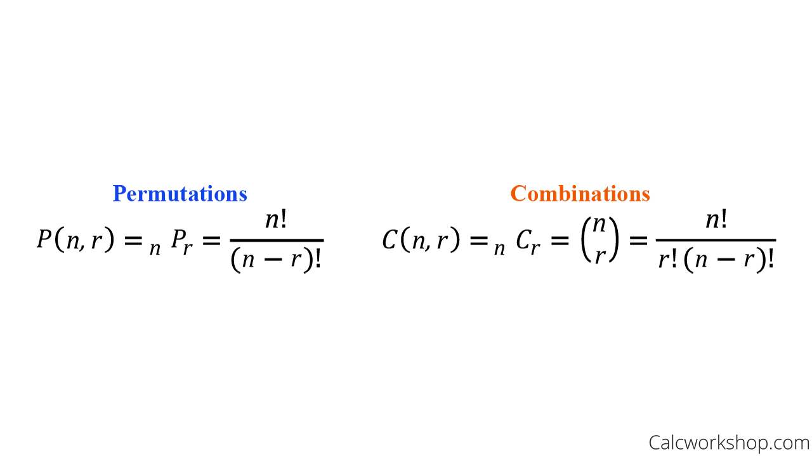

# CMPS 2433 Discrete Structures and Analysis Friday, Dec. 3, 2021
## Program 4 Combinatorics 9AM, no late assgs
### Purpose: 
Reinforce concepts of modulo arithmetic and combinatorics; also uses a while !eof 
loop.

### Problem: 
Dr. Olympia organizes programming competitions across the south central region of 
the US. Next month there will be a competition and there are many schools that want to 
participate and each of them has many students on their teams. Anyway, only some of the 
students and only some of the schools will be selected to participate in this competition. 
Question is, how many combinations of students can participate in the competition?
More specifically: There are `N schools from which exactly A schools will participate`. Moreover,
there are `B students in each school and exactly D of them will participate in the competition`.
Dr. Olympia could count herself, but this process takes too much time and the limits for schools 
and students are changing every moment, so she has decided to make a program for it (in fact 
she has decided that you will make the program for her)!

### Input: 
The input will come from a file and may contain up to 104 lines, each containing four 
integers `N, A, B, D, where 1 ≤ A ≤ N ≤ 105
, 1 ≤ D ≤ B ≤ 105`

### Output: 
Output is to go to a file. For each line, print the number of combination of students, 
which can participate in the competition. All students and universities are distinguishable, but 
their order doesn't matter.
Since the answer might be huge, print it modulo `10^9+7 (1000000007)`.

### Hints: 
* Use unsigned long long int for your result and for the result of the modulo arithmetic.
* Code an iterative factorial function.
* Code combinatorial function to call the iterative factorial functions.


Sample Input:
``` c++
2 1 2 2
2 2 2 1
2 1 2 1
4 3 3 2
4 2 1 1
10 4 12 7
50 30 44 20
```
>

Sample Output:
``` c++
Catherine Stringfellow
Program 4: Combinatorial Teams

2
4
4
108
6
625817778
154746653
```

>

### TURN IN (UPLOAD TO D2L):
* Upload Prog4.cpp
* Deliver to class: printout of prog4.cpp, two input files, two output files and hand calculations

